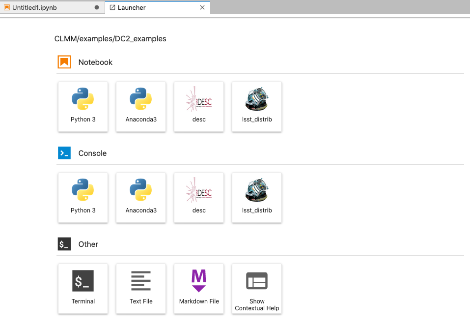

# JupyterLab kernel configuration for DESC sofrware

## Introduction
This repository contains a [kernel specification](https://jupyter-client.readthedocs.io/en/stable/kernels.html) for executing [JupyterLab](https://jupyterlab.readthedocs.io/en/stable/) notebooks which use the DESC science environment at CC-IN2P3.

When you launch JupyterLab, you will see a screen similar to the one below:



Push the `desc` button to launch a server already configured to use DESC software (e.g., GCRCatalogs)

## Installation

Execute the instructions below after logging into CC-IN2P3.

```
git clone https://github.com/combet/desc-jupyter-kernel.git /tmp/desc-jupyter-kernel
cd /tmp/desc-jupyter-kernel
bash ./install.sh
```

After a successful installation, the following directory will be created `$HOME/.local/share/jupyter/kernels/desc`.

This directory is populated with files needed by JupyterLab to launch your notebook.

## Credits

### Author
This tool was adapted from the one developed by Fabio Hernandez at https://github.com/airnandez/lsst-jupyter-kernel

## License
Copyright 2020 Celine Combet

Licensed under the Apache License, Version 2.0 (the "License");
you may not use this file except in compliance with the License.
You may obtain a copy of the License at

[http://www.apache.org/licenses/LICENSE-2.0](http://www.apache.org/licenses/LICENSE-2.0)

Unless required by applicable law or agreed to in writing, software
distributed under the License is distributed on an "AS IS" BASIS,
WITHOUT WARRANTIES OR CONDITIONS OF ANY KIND, either express or implied.
See the License for the specific language governing permissions and
limitations under the License.

